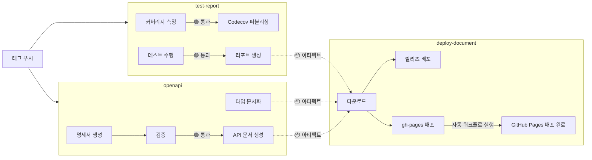

## 🚚 CI/CD 파이프라인

&nbsp;&nbsp;&nbsp;&nbsp;&nbsp;&nbsp; <a href="https://github.com/Daily1Hour/PickMe-Reminder-Service/actions" title="GitHub Actions">  GitHub Actions 바로가기 </a>

```mermaid
graph LR
    Tag[태그 푸시] ---> test-report & openapi

    subgraph test-report
        direction LR
        Test/Coverage[커버리지 측정] --> |🟢 통과|Test/Codecov[Codecov 퍼블리싱]
        Test/Execution[테스트 수행] --> |🟢 통과|Test/Report[리포트 생성]
    end

    subgraph openapi
        direction LR
        Docs[타입 문서화]
        OpenAPI/Define[명세서 생성] --> OpenAPI/Validate[검증] --> |🟢 통과|OpenAPI/Publish[API 문서 생성]
    end

    Test/Report & Docs & OpenAPI/Publish -.-> |📦 아티팩트|Artifact/Download

    subgraph deploy-document
        direction LR
        Artifact/Download[다운로드] --> Release[릴리즈 배포]
        Artifact/Download --> DeployGH[gh-pages 배포] --> |자동 워크플로 실행|pages-build-deployment[GitHub Pages 배포 완료]
    end

    click Test/Execution,Docs,OpenAPI/Define,DeployGH "https://github.com/Daily1Hour/PickMe-Reminder-Service/actions/workflows/document-hosting.yml"
    click pages-build-deployment "https://github.com/Daily1Hour/PickMe-Reminder-Service/actions/workflows/pages/pages-build-deployment"
```
